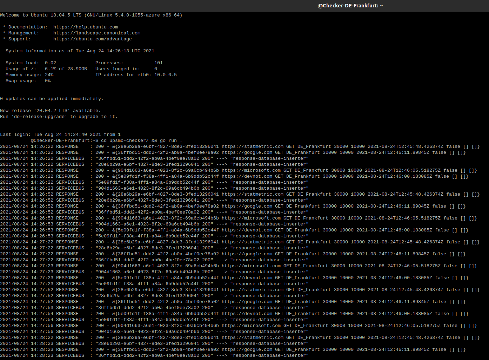

# upsmo-checker

It runs in different locations on the Azure virtual machines and checks uptime monitors by region and takes actions according to the HTTP response, such as sending messages to the Azure service bus.

## Prerequisites to run

* [Golang](https://golang.org/dl/)

## Installation & Run

* `git clone https://github.com/halilkocaoz/upsmo-checker.git`
* `export REGION="DE_Frankfurt"`
Look [here](https://github.com/halilkocaoz/upsmo-server/blob/main/UpsMo.Common/Monitor/MonitorRegion.cs) for more
* `export AZURE_POSTGRES_CONNSTR="host=name.postgres.database.azure.com port=5432 dbname=- user=- password=-"`
* `export SERVICE_BUS_NAMESPACE="namespace"`
* `export SERVICE_BUS_SHARED_ACCESS_KEY_VALUE="key"`
* `cd upsmo-checker && go mod download && go run .`

## Related repositories

* [upsmo-response-inserter](https://github.com/halilkocaoz/upsmo-response-inserter)
* [upsmo-notifier](https://github.com/halilkocaoz/upsmo-notifier)
* [upsmo-server](https://github.com/halilkocaoz/upsmo-server)

## Screenshot

